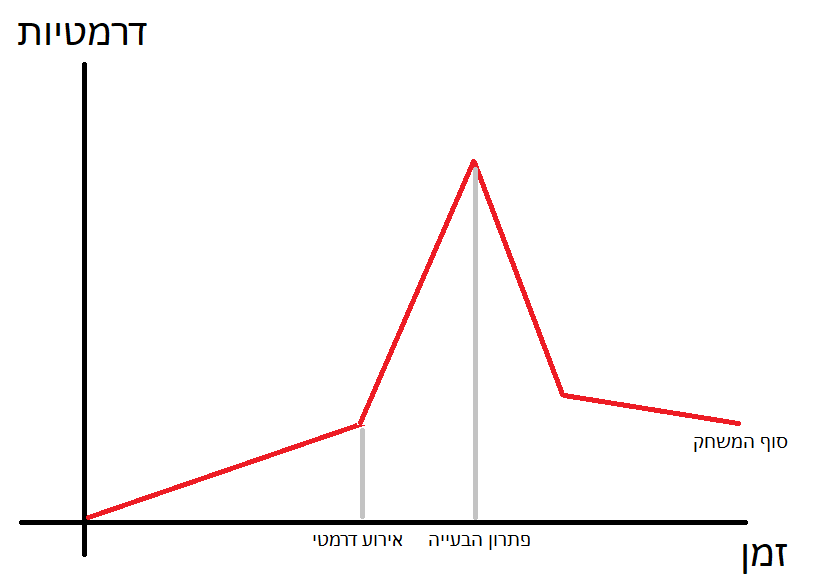

<h1>אתגר</h1>
כישורים: השחקן יצטרך כישורי ניווט בים. בנוסף לכך הוא יצטרך כישורי אסטרטגיה וניהול מהשאבים על מנת להילחם כמו שצריך ולהמשיך לשדרג את הספינה.
  
רמת קושי דינאמית - ככל השחקן יתקדם הוא יצטרך  למצוא אוצרות שיותר אויבים מגנים עליהם, בנוסף לכך יהיה מנגנון שיזמן יותר איבים בים ככל שלשחקן ילך יותר טוב.

<h1>זרימה</h1>
מיקוד תשומת לב: אמקד את תשומת הלב בעזרת Sound Cues כאשר קורים דברים במשחק ובעזרת זימון אויבים כאשר המשחק נהיה "משעמם" לפרק זמן ארוך שלא קרה בו כלום.
  
תחושת שליטה: השחקן יקבל תחושה של שליטה בכך שהוא ישיג אוצרות ויוכל לשדרג את הסירה שלו. בהתאם לאיך שהוא יבנה אותה וילחם באויבים המשחק יהיה יותר קל/ קשה ולכן הפעולות שלו משפיעות ישירות עליו.
  
משוב: כאשר שחקן יפשל יותר מידי הוא ימות במשחק וזה יהיה המשוב.

<h1>שעשוע</h1>
דברים לא קשורים למטרת המשחק - השחקן יוכל לעצב ויזואלית את הספינה שלו כמו שירצה.
  
סוגי שחקנים - המשחק יתאים לסוג הסייר ולאספן, הסייר יוכל לחקור את העולם ולראות מקומות חדשים והאספן יוכל להשתפר במשחק , לאסוף את כל האוצרות ולשדרג את הספינה.
  
סוגי שחקנים נוספים: אפשרי להוסיף פאזלים למשחק כך שהוא יתאים גם לסוג השחקן הבלשי.

<h1>רגשות</h1>
רגשות במהלך המשחק: השחקן אמור להרגיש תחושות רוגע בזמן שהוא שט בעולם, כאשר הוא מלחם ומשיג אצרות הוא אמור להגיש תחושות הצלחה כאשר מנצח ותחושת תסכול קטנה כאשר הוא מספיד. 
  
עיצוב משחק: המשחק יגרום לרגשות אלו בעזרת המוזיקה והצלילם השונים שיתנגנו בזמן המשחק. את התחושות של הניצחון והתסכול הוא יקבל לפי איך שיראו קרבות במשחק.

<h1>סיפור רקע</h1>
רקע: לפני תחילת המשחק, הפיראט שאיתו נשחק היה במצוקה כלכלית ולכן הלך לשוט בים בשביל למצוא אוצרות בשביל חיים יותר טובים. סיפור רקע זה יועבר באקספוזיציה בתחילת המשחק.

<h1>דמויות</h1>
דמות מרכזית: הפיראט שאיתו השחקן משחק.
מתנגדים: הפיראטים והאובים השונים שבהם נלחמים במהלך המשחק.
דמויות משנה: NPCs שלוחקים מהם משימות ותוכי שהוא שותף של השחקן הראשי.
  
שוני בדמויות: במהלך המשחק הפיראטים שנגדם נלחמים נהיים חזקים יותר וכך גם כן השחקן.

דמויות עם רצון חופשי: האוביום יתנהו באופן של רצון חופשי משום שהם יזוזו וילחמו נגד השחקן כרצונם, לעומת זאת הדמויות המביאות משימות יהיו סטטיות ולא יזוזו הרבה.

<h1>עלילה</h1>

במהלך המשחק יהיה אירוע דרמטי שבו יגנבו את חברו הטוב של השחקן (התוכי) ובהמשך השחקן ישיג אותו חזרה. בנוסף לכך במהלך עליית הקושי של האויבים כך גם תעלה הדרמטיות.
  
התנהגות השחקן: ככל שהוא ישחק מהר וטוב יותר כך המשחק יתקדם במהירות וכך גם האובים יהיו יותר קשים.

<h1>בניית עולם</h1>
חוקי טבע: יהיו כמו בעולם האמיתי,רק שהמשחק תמיד יהיה שמשי והים שליו. 
גיאוגרפיה: העולם יהיה בנוי מהרבה איים קטנים/גדולים המופרדיםבעזרת ים שהשחקן יוכל לשוט בו. 
כלכלה: כלכלת המשחק תהיה האוצרות שהשחקן מוצא בדרך ואיתם הוא יוכל לקנות דברים שונים. 
חברה: אלמנט החברה בא בעיקר דרך ה NPCs אשר מביאים משימות לשחקן.  

את כל החוקים האלא ילמד השחקן דרך משימות שיתמו לו ודרך ניסוי ותהייה.

