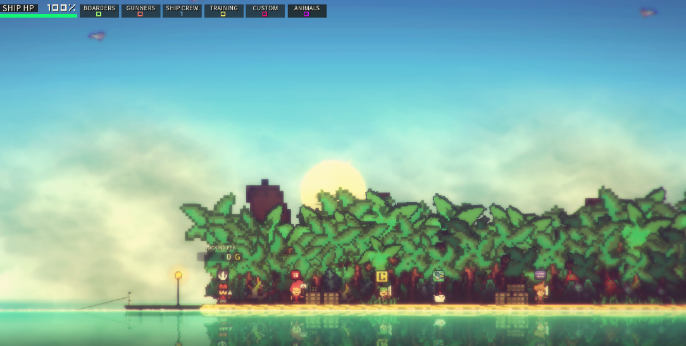
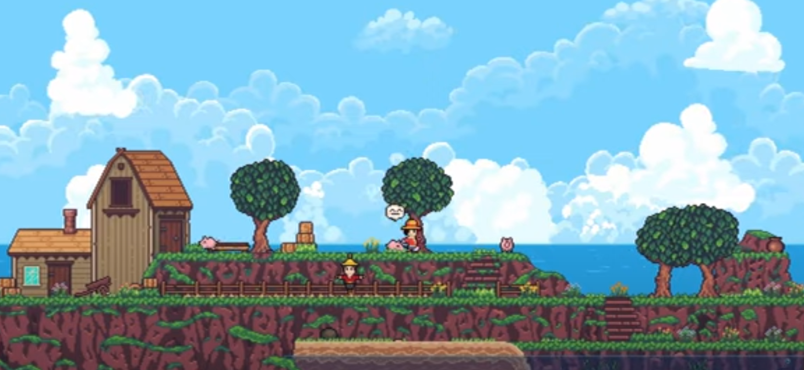
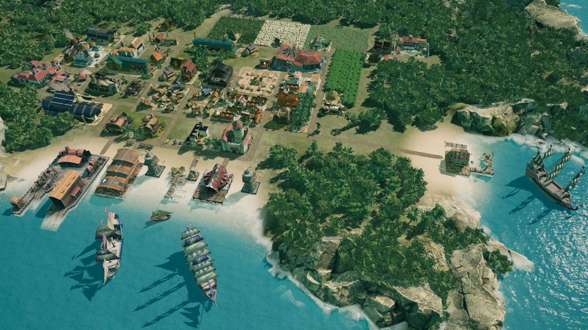

# TideBreak

[Link to itch.io](https://daniel-work-gh.itch.io/tidebreak-v2).

Sail the seas, fight pirates, and uncover treasures.

### Credits :
Assets:
https://assetstore.unity.com/packages/p/low-poly-medieval-ship-266731
https://assetstore.unity.com/packages/p/low-poly-tree-pack-57866
https://assetstore.unity.com/packages/p/low-poly-tree-pack-57866
https://assetstore.unity.com/packages/p/low-poly-tropical-island-lite-242437
https://assetstore.unity.com/packages/p/handpainted-grass-ground-textures-187634

Sounds:
freesound_community on pixabay - https://pixabay.com/users/freesound_community-46691455/
freesound_community on pixabay - https://pixabay.com/sound-effects/sailboat-cockpit-at-12kn-wind-speed-17465/

Code:
floating logic : https://www.youtube.com/watch?v=iasDPyC0QOg&list=PLOs-8muQh1HJgavxDcyUYFM0BMJJh1_Vh 

### Premise 
___
In this top down PC game - the player will sail the seas and travel the map, while traveling he will encounter hostile pirates that want to steal his gold. Fight the pirates and find more gold! The player will be able to upgrade the ship when entering docks. 

### Players
___
The game is aimed for people who enjoy pirate themes, it will be single player with NPCs around the map, they will spawn randomly on the sea and on docks.

Most NPCs are pirates so they will be hostile.

### Objectives 
___
The game objective is to uncover all the hidden treasures hidden around the world. Every time he find one new quests will unlock in the docks.

The game will put markers on the map of places the player need to visit to progress.
### Processes
___
The player will start the game on a run-down ship on his way to find gold, the combat will be easy at the start to the game to avoid rage-quitting.

After finding the gold he will be shown the closes dock where he can use it to fix the ship. This proccess will repeat itself with different locations on the map and different enemies.

The game will end end when all the treasures are collected.
#### Controls
| Action | Keybind |
| - | - |
| Move Up | W |
| Move Left | A |
| Move Right | D |
| Move Down | S |
| Interact | E |
| Open Map (Not added yet) | M | 
| Open Inventory (Not added yet) | I |
| Fire | Mouse Left / Mouse Right |
| Aim (Not added yet) | Mouse |
### Rules
___
The rule is don' die. The ship has an health bar and so does the player, if one of the reaches 0 hp the player losses and respawns.

The other rule is search for gold. The player will be shown the next treasure location on the map so he will retrive it.

He will learn the first rule the hard way and the 2nd will be stated directly on launch.
### Resources
___
The game resources are:
- Gold - Can be found in treasure locations and used to upgrade the ship.
- Health - When the player reaches 0Hp its game over.

Both of the resources will be shown on screen. And by adding enemies near gold locations it will ensure the game wont be too easy.

### Encounters
___
The main encounter will be pirates, they will roam freely around the map, on land and on waters. Some areas will have stronger pirates then others.

The player will have to upgrade the ship to defeat them.

### Confines
___
The game will have a flat open world, it will be shown by pressing M. If the player leaves the map area his ship will sink and he will respawn.

To make travelling faster and more interesting pirates will spawn on sea and on land. To move faster around the map the player will use the ship, while he will be on foot when searching for the treasure on land.

The world map and markers will ensure the player wont be lost.

### Ending
___
The game will have one ending - finding all the treasures. The ending will be based mostly on skill beacause of the combat aspect. 

### Market survey
___
After searching for "2D pirate games" i found:

## [Pixel Piracy](https://store.steampowered.com/app/264140/Pixel_Piracy/)

This game looks pretty good, but as stated in review it was very buggy. Bugs are unavoidable but i intend to remove any game-breaking ones before release.

## [Seablip](https://www.rockpapershotgun.com/seablip-is-a-pixel-art-pirate-em-up-out-now-in-early-access)

This game also has a nice artstyle and seems to have fun gameplay. But many people dont like 2D side scrollers, my art direction is 2D top down which will allow the player to explore 'more'.

## [Republic Pirates](https://store.epicgames.com/en-US/p/republic-of-pirates-b6dfa6)

This game seems to be a top down stratagy game, many people dislike games that give control of many units. My game has one unit that the player can control, making it more accessible to wider audience.

## Current Project State

